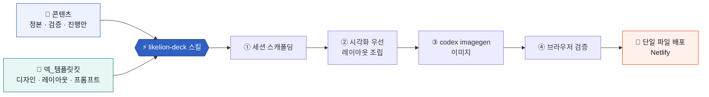

<div align="center">


# 🦁 SKU LIKELION · 강의덱 제작 시스템

**한 벌의 템플릿킷으로, 매번 같은 퀄리티의 강의덱을.**

브라우저에서 바로 발표하는 단일 HTML 웹덱 — 방향키 발표 · 전체화면 · PDF 출력까지, 파일 하나로.

<p>


</p>

<sub>
<a href="#-이게-뭔가요">소개</a> ·
<a href="#-시스템-한눈에">시스템</a> ·
<a href="#-새-강의덱-만들기">새 덱 만들기</a> ·
<a href="#-절대-규칙--0-불변-요소">절대 규칙</a> ·
<a href="#-세션-목록">세션 목록</a> ·
<a href="#-미리보기--배포">미리보기 · 배포</a>
</sub>

</div>

---

## ✨ 이게 뭔가요

강의덱을 **매번 처음부터** 만들지 않기 위한 저장소입니다. 디자인·레이아웃·이미지 규칙을 **한 곳(템플릿킷)** 에 모아 두고, 주제가 바뀔 때마다 **세션 폴더 하나**만 새로 만들어 조립합니다. 그래서 어떤 주제든 **같은 톤·같은 완성도**로 나옵니다.

<table>
<tr>
<td width="33%" valign="top">

### 🎨 한 벌의 디자인
색·타이포·레이아웃·클레이 3D 이미지 규칙을 `덱_템플릿킷/` 한 곳에서 관리. 고치면 **모든 세션에 반영**.

</td>
<td width="33%" valign="top">

### 📁 주제별 격리
세션마다 독립 폴더. 하나를 손봐도 다른 주제 **무영향**. 통째로 복사·보관·배포가 쉬움.

</td>
<td width="33%" valign="top">

### ⚡ 스킬로 자동화
`likelion-deck` 스킬이 스캐폴딩→조립→이미지 프롬프트→검증→배포까지 안내. **"새 덱 만들어줘"** 한마디로 시작.

</td>
</tr>
</table>

---

## 🧭 시스템 한눈에



> **원칙**: 콘텐츠는 정본(`.md`)에서 시작 → 슬라이드는 콘텐츠에서 나온다. **이미지는 Claude가 만들지 않고 codex imagegen이** 만든다.

---

## 🗂 저장소 구조

```
📦 BM
├─ 🎨 덱_템플릿킷/          공유 · 모든 세션이 재사용
│   ├─ 00_레이아웃-선택가이드.md     상황 → 레이아웃
│   ├─ styles/deck.css              디자인 시스템 + 전 레이아웃 (단일 CSS)
│   ├─ starter/deck-template.html   새 덱 뼈대
│   ├─ layouts/카탈로그.html        레이아웃 라이브러리(방향키로 미리보기)
│   ├─ images/공통이미지프롬프트.md  clay v2 3D 프롬프트
│   ├─ guide/디자인시스템.md
│   ├─ reference/                   원본 레퍼런스(design.md 등)
│   └─ img/                         킷 자체 데모 이미지(독립형)
│
├─ 📁 세션/
│   └─ BM_수익모델/          세션 #1
│       ├─ *_강의덱.html · *_배포.html   덱(개발 · 배포)
│       ├─ img/ · dist/ · _redirects
│       ├─ 비즈니스모델_수익모델_정리본.md   정본(원천)
│       ├─ _컨텍스트 · 검증리포트 · 진행안(run-of-show)
│       └─ 슬라이드/                  pptx 트랙(build_deck.js 등)
│
└─ ⚡ .claude/skills/likelion-deck/   덱 제작 자동화 스킬
```

<details>
<summary>📂 스킬 내부 구조 펼치기</summary>

```
.claude/skills/likelion-deck/
├─ SKILL.md                   6단계 워크플로우 · §0 불변 규칙
├─ scripts/
│   ├─ scaffold_session.py    세션 스캐폴딩 (--parts N 자동 divider)
│   ├─ make_prompt_sheet.py   이미지 슬롯 → codex imagegen 프롬프트 시트
│   └─ inline_images.py       base64 단일 파일 배포
├─ references/
│   ├─ visual-first.md ★      관계·비교·흐름은 텍스트가 아니라 도형으로
│   ├─ layout-cheatsheet.md   상황 → 레이아웃 클래스
│   ├─ deck-assembly.md       조립 문법 · 불변 규칙
│   └─ image-and-deploy.md    이미지 계약 · 배포
└─ evals/evals.json           테스트 케이스
```
</details>

---

## 🚀 새 강의덱 만들기

**가장 쉬운 방법 — 스킬에게 말하기:**

```
"다음 주차 '사용자 리서치 기초'로 강의덱 만들어줘. 4개 파트, 표지·아젠다까지."
```

그러면 스킬이 아래를 순서대로 진행합니다:

| 단계 | 하는 일 |
|:--:|---|
| **1** | 주제·주차·파트 확인 |
| **2** | `세션/<주제>/` 스캐폴딩 (고정 표지·아젠다 채움, 파트 수만큼 전환 슬라이드 생성) |
| **3** | **시각화 우선** — 관계·비교·흐름 정보는 도형 레이아웃으로 조립 |
| **4** | 이미지 슬롯 → **codex imagegen 프롬프트 시트** 산출 (생성은 codex가) |
| **5** | 브라우저(:8532)로 검증 |
| **6** | (선택) base64 **단일 파일**로 배포 |

<details>
<summary>🛠 스크립트로 직접 하려면</summary>

```bash
# 1) 세션 생성 (4개 파트 전환 슬라이드 자동 생성)
python .claude/skills/likelion-deck/scripts/scaffold_session.py \
  --topic 사용자리서치기초 --week 12 --title "사용자 리서치 기초" --presenter "이름" --parts 4

# 2) 이미지 프롬프트 시트 (codex imagegen용)
python .claude/skills/likelion-deck/scripts/make_prompt_sheet.py 세션/사용자리서치기초/사용자리서치기초_강의덱.html

# 3) 배포용 단일 파일
python .claude/skills/likelion-deck/scripts/inline_images.py 세션/사용자리서치기초/사용자리서치기초_강의덱.html
```
</details>

> 디자인을 바꾸고 싶으면 `덱_템플릿킷/styles/deck.css` **한 곳만** 고치세요 — 모든 세션이 상속합니다.

---

## 🔒 절대 규칙 — §0 불변 요소

모든 덱에서 **원본 그대로** 유지되는, 협상 불가 규칙 5가지입니다.

| # | 규칙 | 뜻 |
|:--:|---|---|
| **1** | 고정 페이지 **1·2·3** | 표지·도입·아젠다는 구조 그대로, 텍스트만 교체 |
| **2** | 하단 **네비게이션 바** | 방향키·카운터·전체화면 컨트롤 |
| **3** | 첫 페이지 **PDF 버튼** | 표지에서만 노출되는 PDF 다운로드 |
| **4** | 이미지는 **codex imagegen** | 스킬/Claude는 프롬프트까지만, 생성은 codex |
| **5** | 파트마다 **전환 슬라이드** | 파트 시작 앞에 "PART n / N" 표지 필수 (**1파트 포함**) |

> 📖 파트 전환 = 책의 "제2장" 표지 같은 슬라이드. 진행 도트(●●●●) + `PART n / N` + 파트 제목 + 한 줄 설명. **파트 수 = 전환 슬라이드 수.**

---

## 🎨 디자인 언어

<table>
<tr>
<td valign="top">

**색 (브랜드 토큰)**
| 토큰 | 값 |
|---|---|
| 주 강조 cobalt | `#3060C3` |
| 표지 electric | `#2F6BF8` |
| 헤더 라인 ice | `#8EC3FF` |
| 3D 깊이 navy | `#233B66` |
| 잉크 | `#141821` |

</td>
<td valign="top">

**규칙**
- 폰트 **Pretendard** + 숫자 Inter
- 캔버스 **1280×720** (16:9)
- 색은 **문법** — 강조는 코발트 1곳, 오렌지·레드는 문제·경고만
- 관계·흐름 정보는 **도형**으로(슬라이드 예: BM ⊃ 수익모델 = 벤 다이어그램)

</td>
</tr>
</table>

<details>
<summary>🧱 레이아웃 라이브러리 (20+ 종)</summary>

- **고정**: 표지 · 도입 · 아젠다 · 파트 전환
- **텍스트형**: 중심 메시지 · 개념+3D · 리마인드 · 3요소 · 표 · 카드 그리드
- **도형형**: 벤(포함) · 액터(2주체) · 비교(2열) · 흐름 · 역기획 보드 · 린캔버스 9칸 · 위험 검증 · 지표 · 매핑(A→B) · 가격 방법
- **클로징**: 요약 인포그래픽 · 다크 마무리

실물은 `덱_템플릿킷/layouts/카탈로그.html`을 방향키로 넘겨 보세요.
</details>

---

## 📚 세션 목록

| 세션 | 주제 | 덱 |
|---|---|---|
| [`세션/BM_수익모델`](세션/BM_수익모델/README.md) | BM — 비즈니스 모델 & 수익 모델 (UXUI 16주차) | 26장 · HTML 웹덱 |

---

## 🖥 미리보기 & 배포

**로컬 미리보기** — `.claude/launch.json`의 `static`(포트 **8532**)으로 저장소 루트에서 정적 서버:
- 레이아웃 둘러보기 → `덱_템플릿킷/layouts/카탈로그.html`
- BM 덱 보기 → `세션/BM_수익모델/BM_수익모델_강의덱.html`

**배포 (Netlify · 드래그앤드랍)** — 세션의 `dist/`(base64 단일 파일 + `_redirects`)를 Netlify에 드롭. `_redirects`가 루트를 배포본으로 200 리라이트합니다.

---

<div align="center">
<sub>Made with 🦁 by <b>SKU LIKELION · UX/UI Team</b> — 디자인 한 곳에서, 강의덱은 무한히.</sub>
</div>
